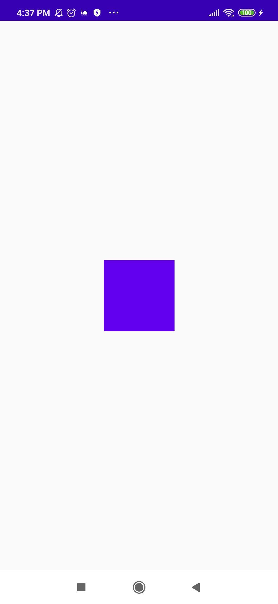
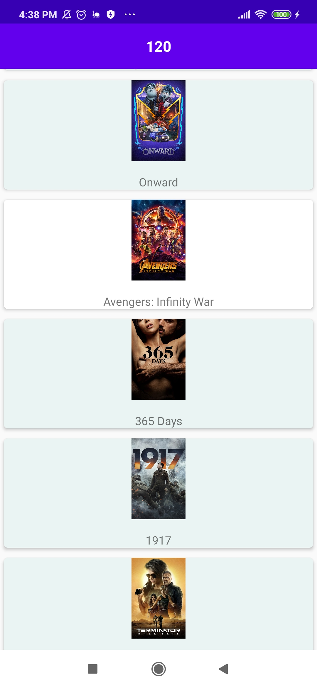
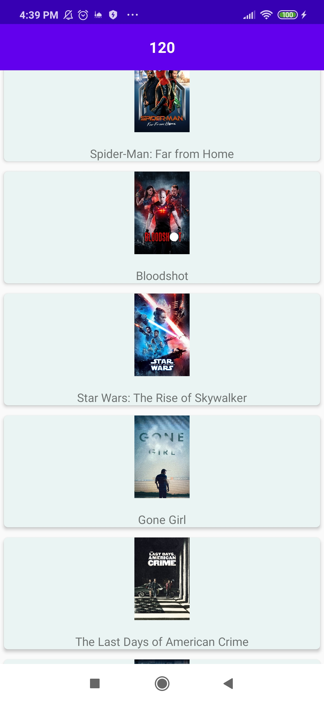
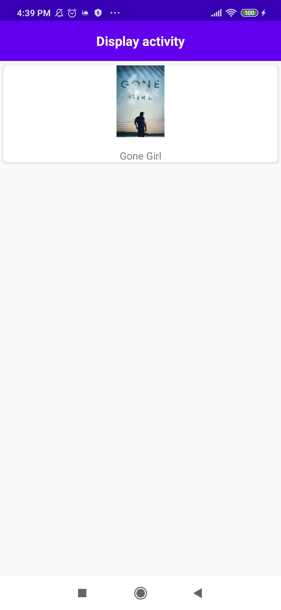
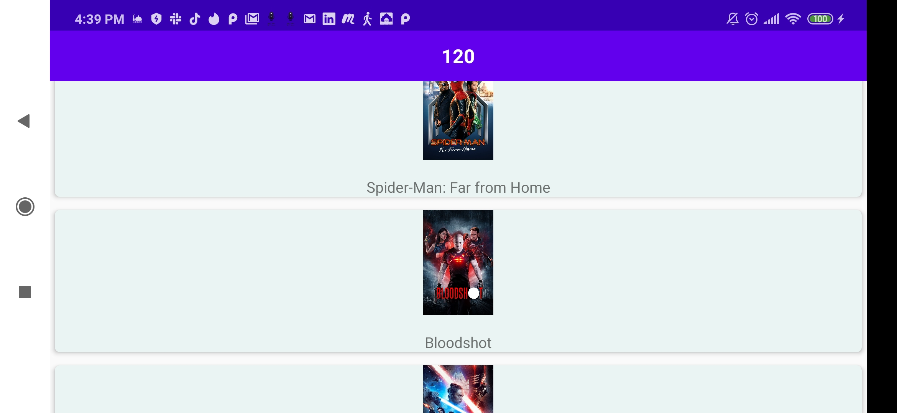

# movieExample
<h1>Android-MVVM-with-Retrofit</h1>
This is sample project to express how to use Android MVVM architecture and Jetpack components
 
Idea => app that fetch movies from Mdbi API

<h2>Technology used</h2>
<ul>
    <h5>
        <li>Android</li>
    </h5>
    <h5>
        <li>Kotlin</li>
    </h5>
    <h5>
        <li>MVVM</li>
    </h5>
    <h5>
        <li>LiveData</li>
    </h5>
    <h5>
        <li>ViewModel</li>
    </h5>
    <h5>
        <li>Recyclerview</li>
    </h5>
    <h5>
        <li>Retrofit</li>
    </h5>
    <h5>
        <li>RxJava</li>
    </h5>
    <h5>
        <li>Data Binding (2 ways Data Binding)</li>
    </h5>
    <h5>
        <li>Dagger2</li>
    </h5>
    <h5>
        <li>Junit4 for UnitTest</li>
    </h5>
    <h5>
        <li>Picasso</li>
    </h5>

    <h5>
        <li>Espresso for UI test</li>
    </h5>
</ul>

<html>
<h2>Architecture</h2>
</img>

<h2>Screenshots</h2>
<table border="1" bordercolor="red" align="center">
    <tr>
        <td border=1 height=450 width=300></img>
        </th>
        <td border=1 height=450 width=300></img>
        </th>
    </tr>
    <tr>
        <td border=1 height=450 width=300></img>
        </th>
        <td border=1 height=450 width=300></img>
        </th>
    </tr>

</table>
<td border=1 height=450 width=600></img>
</td>

</html>
